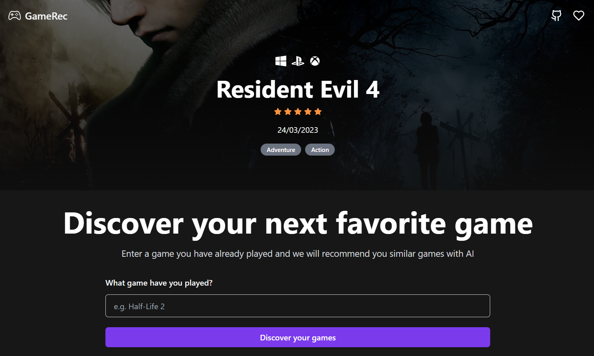

# [GameWizzy](https://gamewizzy.vercel.app/)

This project recommends games with OpenAI. By clicking on the recommended games, you can see the details of the game fetched from RAWG and IGDB APIs. It is bootstrapped with the [T3 Stack](https://create.t3.gg/).

[](https://gamewizzy.vercel.app/)

## Tech Stack

- [Next.js](https://nextjs.org)
- [Prisma](https://prisma.io)
- [Tailwind CSS](https://tailwindcss.com)
- [tRPC](https://trpc.io)
- [OpenAI GPT-3 API](https://platform.openai.com/overview)
- [RAWG API](https://rawg.io/apidocs)
- [IGDB API](https://api-docs.igdb.com)

## Features

- Recommend games using OpenAI GPT-3 API
- Fetch game details from RAWG and IGDB APIs
- Add games to favorites list
- Filter favourited games by platform

## Installation

### 1. Clone the repository

```bash
git clone https://github.com/sadmann7/game-wizzy.git
```

### 2. Install dependencies

```bash
yarn install
```

### 3. Create a `.env` file

Create a `.env` file in the root directory and add the environment variables as shown in the `.env.example` file. You can get the OpenAI API key from [here](https://beta.openai.com/account/api-keys). You can get the RAWG API key from [here](https://rawg.io/apidocs). You can get the IGDB API key from [here](https://api-docs.igdb.com/#about).

### 4. Run the application

```bash
yarn run dev
```

The application will be available at `http://localhost:3000`.

## Deployment

Follow the deployment guides for [Vercel](https://create.t3.gg/en/deployment/vercel), [Netlify](https://create.t3.gg/en/deployment/netlify) and [Docker](https://create.t3.gg/en/deployment/docker) for more information.
